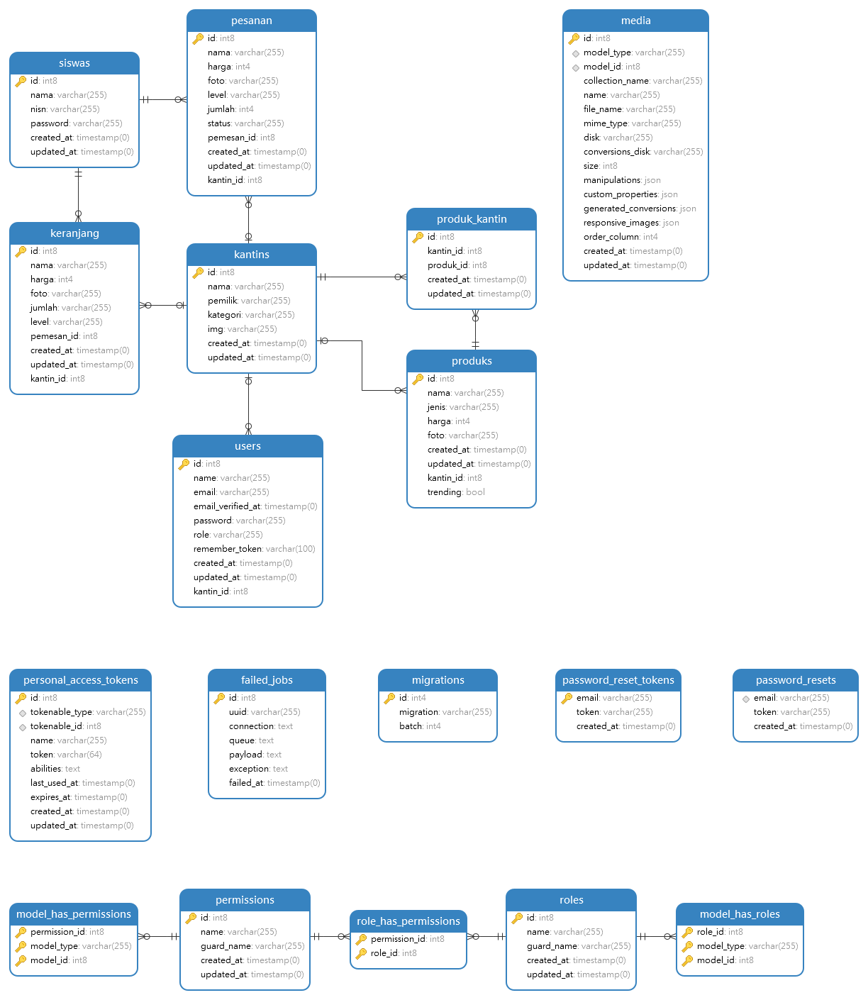
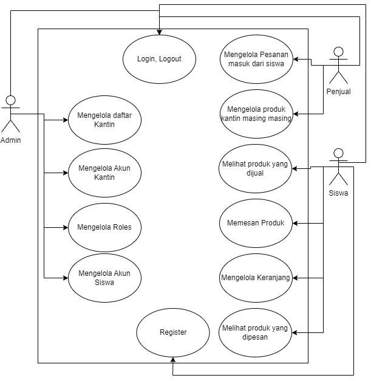

# **Konsep Website**
Website Kantin Digital untuk sekolah

## **Fitur Website**
- **Authentication**: Register, Login, Logout
- **Halaman Beranda**
- **Halaman Keranjang**
- **Halaman Pesanan**

## **Multi User**
### **Admin:**
- Mengelola Daftar Kantin 
- Mengelola Roles
- Mengelola Akun Kantin
- Mengelola Akun Siswa

### **Akun Kantin:**
- Mengelola produk kantin masing-masing
- Mengelola pesanan yang masuk dari siswa

### **Akun Siswa:**
- Melihat produk yang dapat dipesan
- Memesan produk
- Mengelola keranjang
- Melihat produk apa saja yang sudah dipesan

## **Akun Default untuk Pengujian**

### **Admin**
- **Email**: admin@example.com
- **Password**: password

### **Kantin 1**
- **Email**: aqua@gmail.com
- **Password**: password

### **Kantin 2**
- **Email**: mangkoko@gmail.com
- **Password**: password

### **Siswa**
- **NISN**: 0077723063
- **Password**: password

**Admin** dan **Akun Kantin** login di URL `/admin/login` (Contoh: [http://127.0.0.1:8000/admin/login](http://127.0.0.1:8000/admin/login))

**Akun Siswa** login di URL `/login` (Contoh: [http://127.0.0.1:8000/login](http://127.0.0.1:8000/login))

Akun Kantin dapat dibuat manual oleh Admin di **Filament** pada tab **Kantins** dan **Users** melalui URL `/admin/login` -> **Email**: `admin@example.com` **Password**: `password`.

Akun Siswa dapat dibuat manual oleh siswa yang akan mendaftar di URL `/register`.

**Produk** dapat diisi manual oleh akun Kantin.

## **Teknologi yang Digunakan**
- **[Laravel 10](https://laravel.com/)**
- **[Laravel Filament](https://filamentphp.com/)**
- **[Bootstrap 5.3](https://getbootstrap.com/)**

## **Persyaratan Instalasi**
- **PHP 8.1.10**
- **[Laragon](https://laragon.org/)**
- **[PostgreSQL](https://www.postgresql.org/)**
- **[Navicat Premium 16](https://www.navicat.com/en/products/navicat-premium)**
- **Web Browser**

### **Entity Relationship Diagram (ERD)**


### **UML Use Case Diagram**



## **Instalasi**
1. **Clone Repo**
   ```bash
   git clone https://github.com/DaffaIhsan17/ujikom
   composer install
   cp .env.example .env
   ```
4. **Konfigurasi Database pada file `.env`
   ```bash
    DB_CONNECTION=pgsql
    DB_HOST=127.0.0.1
    DB_PORT=5432
    DB_DATABASE=ujikom
    DB_USERNAME=postgres
    DB_PASSWORD=
   ```

3. **Migrasi dan Menyambungkan Storage**
   ```bash
   php artisan key:generate
   php artisan storage:link
   php artisan migrate --seed
   ```

4. **Mulai Website**
   ```bash
   php artisan serve
   ```


